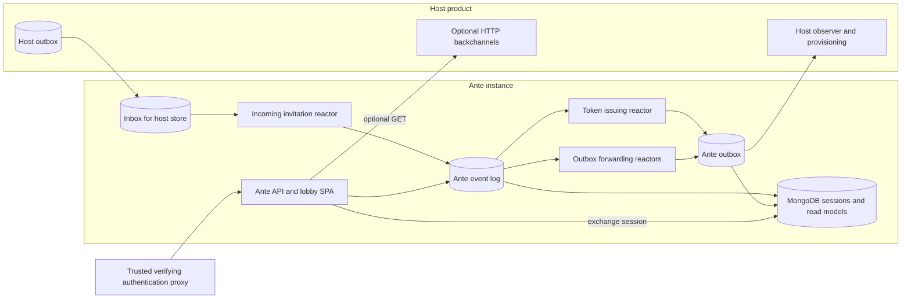

An invitation crosses two event stores and several distinct sequences. Ante's command completing does not mean the host has provisioned a user. The diagram separates each handoff.

The proxy sends `POST /_invite/exchange` through Ante's API, which writes an accepted-invitation session to MongoDB. Host invitation events become local receipt events before a token is issued. An invitation-bound command records acceptance in Ante's event log; forwarding reactors then append the public fact to Ante's outbox. `InvitationTokenIssued` is different: its reactor appends directly to the outbox. MongoDB also holds pending and publication read models projected from events.

## Routing and identity

Ante selects its own Chronicle store and one fixed namespace per instance. Its incoming inbox subscription targets the host store compiled as `Direct` in `InboxSourceStore.Name`; changing `Ante:EventStore` does not change that target. Contracts carry an assembly-level `Ante` store annotation, so a host observing an Ante store renamed from `Ante` must explicitly route its observer to the configured store. The host mints a GUID invitation id and uses it as the event source id; the token `jti` carries the same id. A correlation id is separate event metadata, not the invitation id.

The proxy and API access conditions that make this topology safe are specified in [Security and trust](./security.md). See [Contracts](./contracts.md) for the event and HTTP boundaries.
