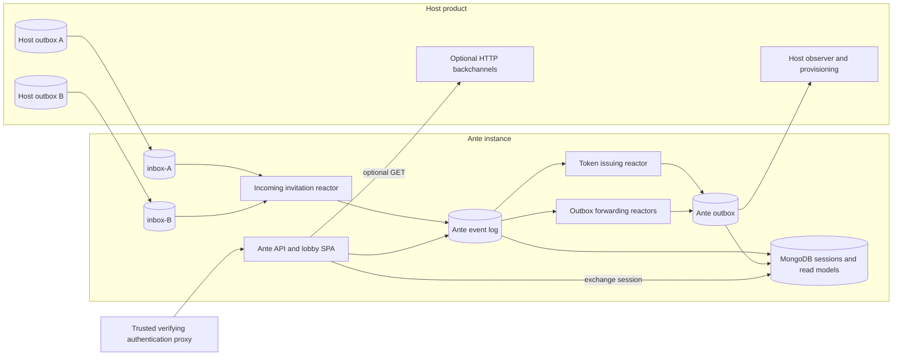

An invitation crosses its host source store and Ante's destination store through distinct sequences. Ante accepts several trusted host stores, each with its own inbox and observer. Ante's command completing does not mean the host has provisioned a user.

The proxy sends `POST /_invite/exchange` through Ante's API, which writes an accepted-invitation session to MongoDB. Host invitation events become local receipt events before a token is issued. An invitation-bound command records acceptance in Ante's event log; forwarding reactors then append the public fact to Ante's outbox. `InvitationTokenIssued` is different: its reactor appends directly to the outbox. MongoDB also holds pending and publication read models projected from events.

## Routing and identity

Ante selects its own Chronicle store and one fixed namespace per instance. `Ante:HostStores` independently selects host sources: one filtered source-outbox subscription and one runtime reactor over `inbox-{source}` per store. The original Direct reactor id and subscription id are retained so its observer cursor can resume after an upgrade; the typed incoming reactor is no longer discovered. Runtime callbacks deserialize with Chronicle's event serializer and append local receipt events before acknowledging delivery. The local event log continues to drive token issuance and read models.

The contracts assembly still carries an `Ante` store annotation. A host observing an Ante store renamed from `Ante` can reference the package by explicitly binding its observer to the actual store. The host mints globally unique GUID invitation ids across *all* configured stores and uses the canonical string as event source id; token `jti` carries the same id. A correlation id is separate event metadata. Multiple sources have neither a global event order nor exactly-once delivery, and Chronicle does not remap namespaces.

The proxy and API access conditions that make this topology safe are specified in [Security and trust](./security.md). See [Contracts](./contracts.md) for the event and HTTP boundaries.
