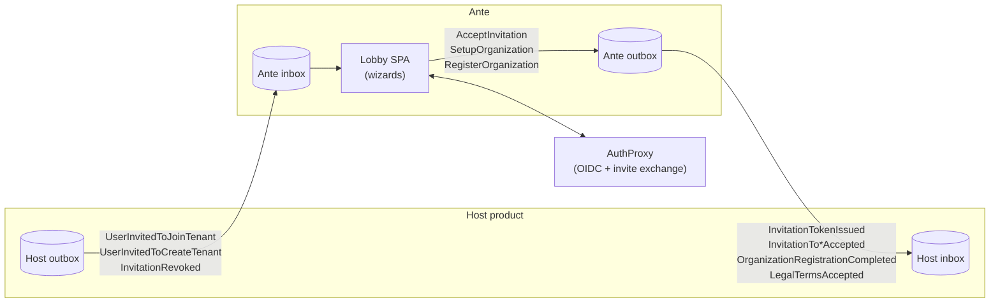

Getting people into a SaaS product starts before they have an account. Someone has to be invited, the invitation has to be trustworthy, and the moment an invitee actually registers has to connect back to the invitation that brought them in. Doing this ad hoc in every product means re-solving the same problems each time: how invitations are issued, how they are verified, and how the rest of the system learns that an invitee arrived.

Ante's scope is exactly that slice: **signed invitations**, a **lobby** where invitees onboard, and **event-based coordination** so the surrounding system can react to what happens. It does not send email, does not author legal text, and does not provision tenants — it hands the host clean, correlated events at each step and lets the host do the rest.

## Without Ante, with Ante

Without a dedicated invitation system, every product re-implements the same brittle pieces: a signing scheme for invitation tokens, a page that turns a token into a session, a form that collects the invitee's name, and a state machine that waits for all of that to finish before redirecting back. Each implementation drifts a little from the others, and the signing key ends up copied into more places than anyone can audit.

With Ante, one signing key lives in one place, one lobby UI handles all three onboarding journeys (join a tenant, create a tenant, self-service register), and the host only has to emit three event shapes in and consume five event shapes out — see [Host Integration](./host-integration.md).

## Two audiences

This documentation set serves two different readers:

- **The host-product integrator** — the developer wiring their own product up to Ante: appending the invitation events Ante consumes, subscribing to the events Ante produces, and standing up the identity backchannel that forwards a signed-in user's claims through an authentication proxy. Start at [Host Integration](./host-integration.md).
- **The operator deploying an instance** — the person standing up a running Ante container for a product: MongoDB, a Chronicle event store, the RSA signing keypair, and the handful of environment variables that make one Ante instance a single product's lobby. Start at [Getting Started](./getting-started.md) and [Deployment](./deployment.md).

## How Ante fits

The host owns invitations, provisioning, and email. Ante owns the signing key, the lobby UI, and the correlation between an invitation and what an invitee submitted.

## Map of the docs

| Page | For | Covers |
|---|---|---|
| [Getting Started](./getting-started.md) | Operator | Running Ante locally, the development signing keypair, minimal configuration |
| [Configuration](./configuration.md) | Operator | Every configuration key, its default, and its effect |
| [Invitation Lifecycle](./invitation-lifecycle.md) | Both | The end-to-end flow: events, reactors, commands, token design, revocation, legal consent |
| [Host Integration](./host-integration.md) | Host integrator | The event contract, correlation, the identity backchannel, AuthProxy requirements |
| [Wizards](./wizards.md) | Both | The three lobby journeys, routing, status polling, redirect behavior |
| [Deployment](./deployment.md) | Operator | The container image, health check, required configuration, what is not yet provided |
| [Boundaries](./boundaries.md) | Both | What Ante deliberately does not do, and why |

Ante is part of the [Cratis](https://www.cratis.io) ecosystem, built on event sourcing with [Chronicle](https://github.com/Cratis/Chronicle) and CQRS with [Arc](https://github.com/Cratis/Arc). The lobby SPA is a React application on [`@cratis/components`](https://github.com/Cratis/Components) over PrimeReact.
