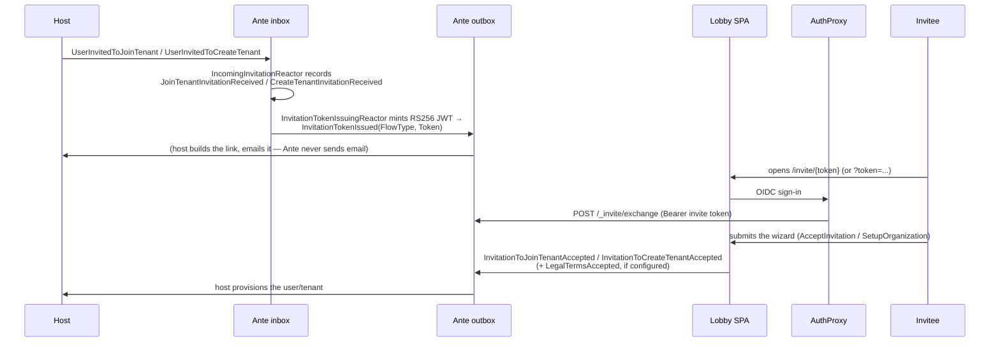

Every invitation Ante ever handles is correlated end to end by one value: the **invitation id**, minted by the host and used as the Chronicle event source id throughout — in the host's own outbox, in Ante's inbox and outbox, and as the `jti` claim of the token Ante issues.

## The flow

## Receiving an invitation

The host appends one of these to its **own** outbox (see [Host Integration](./host-integration.md) for the exact shapes):

- `UserInvitedToJoinTenant(Email, TenantName, Roles)`
- `UserInvitedToCreateTenant(Email, Roles)`
- `InvitationRevoked` (no payload)

`IncomingInvitationReactor`, cross-subscribed to the host's store via the `[EventStore]` attribute, records each as a local event: `JoinTenantInvitationReceived`, `CreateTenantInvitationReceived`, or `InvitationRevocationReceived`. These local events back two read models, `PendingInvitationToJoin` and `PendingInvitationToCreateOrganization`, each removed by `[RemovedWith<...>]` when the matching acceptance or revocation event arrives.

## Issuing the token

`InvitationTokenIssuingReactor` reacts to the freshly-recorded local event and mints an RS256 JWT via `InvitationTokenIssuer`:

- `jti` — the invitation id.
- `invite_type` — `JoinTenant` or `CreateTenant` (`InvitationFlowType`).
- `iss` / `aud` — only set when `Ante:Invitations:Token:Issuer` / `:Audience` are configured; otherwise omitted.
- Expiry — `Ante:Invitations:Token:Expiry`, 7 days by default.

The token is appended to Ante's own outbox as `InvitationTokenIssued(FlowType, Token)`. The host is the one that turns this into a clickable link and emails it — Ante never sends anything itself.

## Opening the link

The lobby reads the token from either `/invite/{token}` or a `token` query-string parameter (`getInvitationToken` in `Invitations/Accepting/invitationToken.ts`). It never verifies the token's signature client-side — it only peeks at the unverified payload to pick which wizard to render before the identity query resolves. The backend is the only place the token is actually trusted, via the exchange endpoint below.

## Exchanging the token for a session

The authentication proxy in front of Ante completes an OIDC sign-in, then calls `POST /_invite/exchange` with the invite token as a `Bearer` credential and a body of shape `ExchangeInviteRequest(Subject, IdentityProvider, ProviderKey?, Issuer?)`. `InviteExchangeProcessor` parses the token locally and checks its shape and expiry — it does not verify the signature; the authentication proxy is the actual trust boundary that must already have validated the caller. A token with no `exp` claim, or one that has already expired, is rejected outright. A valid exchange upserts an `AcceptedInvitation` session document keyed by subject and resolved provider, carrying an expiry copied verbatim from the token's own `exp` claim, so retrying the exchange with the same token — at-least-once delivery, a double-submit, a lost response — converges on the same session instead of creating a duplicate or extending its lifetime. `InvitationIdentityProvider` only honors a session while it remains unexpired, independently of whatever cleanup later removes it from storage. From there, it resolves `InvitationIdentityDetails(InvitationId, FlowType)` for the rest of the request pipeline — first from the `jti`/`invite_type` claims the authentication proxy forwards, falling back to the recorded session.

## Accepting

Three commands complete onboarding, one per journey — see [Wizards](./wizards.md) for the frontend side of each:

| Command | Journey | Resulting event(s) |
|---|---|---|
| `AcceptInvitation(InvitationId, FirstName, MiddleName?, LastName, AcceptedLegalTerms, AcceptedLegalVersion)` | Join an existing tenant | `InvitationToJoinTenantAccepted` (+ `LegalTermsAccepted`) |
| `SetupOrganization(InvitationId, OrganizationName, FirstName, MiddleName?, LastName, AcceptedLegalTerms, AcceptedLegalVersion)` | Create a tenant from an invitation | `InvitationToCreateTenantAccepted` (+ `LegalTermsAccepted`) |
| `RegisterOrganization(RegistrationId, OrganizationName, FirstName, MiddleName?, LastName, AcceptedLegalTerms, AcceptedLegalVersion)` | Self-service, no invitation | `OrganizationRegistrationCompleted` (+ `LegalTermsAccepted`) |

`SetupOrganization` and `RegisterOrganization` both validate the organization name — non-empty, at most 50 characters, and free of characters that would break a downstream MongoDB database name (` / \ . " $ * < > : | ? +`) — and enforce uniqueness twice: an eager read-model check (`AcceptedOrganizationName`, fed by both `InvitationToCreateTenantAccepted` and `OrganizationRegistrationCompleted`) for a friendly validation message, backed by a race-safe `UniqueOrganizationNameConstraint` at append time. That constraint declares both event types under one name, so it is a single coordinated claim boundary across invited tenant creation and self-service registration — not two independent checks that could each let the same name through concurrently. `RegisterOrganization`'s `RegistrationId` reuses `InvitationId`'s shape (an `EventSourceId<Guid>`) as a client-generated correlation key, since self-service registration follows the same "submit, then poll status" pattern as an invitation acceptance, without an actual prior invitation.

Each acceptance is also guarded by a one-use constraint scoped to the invitation itself — `OneUseJoinTenantInvitation` on `InvitationToJoinTenantAccepted` and `OneUseCreateTenantInvitation` on `InvitationToCreateTenantAccepted` — so at most one acceptance can ever be appended per invitation, no matter how many times a client retries or double-submits. `AcceptInvitation` and `SetupOrganization` still read the pending-invitation projection first for a friendly "no longer pending" rejection, but that read model is eventually consistent and cannot by itself prevent two concurrent submits of the same invitation from both observing it as pending; the append-time constraint is what actually makes acceptance one-of-a-kind. A rejection from either constraint surfaces as a normal validation failure on the command result, not an exception.

A reactor per journey (`JoinTenantAcceptanceOutbox`, `OrganizationSetupOutbox`, `OrganizationRegistrationOutbox`) forwards the resulting event to Ante's outbox for the host to observe, alongside the shared `LegalTermsAcceptanceOutbox` for the optional legal fact. None of these reactors mark a command's own success as the end state — see [Publication and durable status](#publication-and-durable-status) below.

## Publication and durable status

Ante distinguishes two states for every acceptance and registration:

- **Recorded** — the local event (`InvitationToJoinTenantAccepted`, `InvitationToCreateTenantAccepted`, or `OrganizationRegistrationCompleted`, plus `LegalTermsAccepted` when one was part of the same append) has committed to Ante's own event log. This is durable, but it is not yet anything the host can see.
- **Published** — those same facts have reached Ante's own outbox, where the host's own observer can pick them up. This is the state the wizards' status polling reports as complete, never Recorded alone: a client that only sees Recorded and nothing else must keep waiting.

Two durable read models per flow back this distinction: `UserSetupProgress` / `OrganizationSetupProgress` project the local event log (the Recorded boundary — `OrganizationSetupProgress` is shared by both the invited-tenant-creation and self-service-registration journeys), and `JoinTenantAcceptancePublished` / `OrganizationSetupPublished` project Ante's own outbox sequence (the Published boundary) for the same event types. A flow counts as fully published only once its own accept/registration fact **and** its legal fact, when one was recorded, have both reached the outbox — a legal fact that lands after the acceptance itself never displays as complete in between.

`UserSetupAcceptanceStatusView.StatusForInvitation` and `OrganizationSetupAcceptanceStatusView.StatusForInvitation` surface this three ways to the client, as `UserSetupAcceptanceStatus` / `OrganizationSetupAcceptanceStatus`: `Pending` (never recorded — safe to submit), `Recorded` (committed locally, not yet published — a client observing this must keep waiting, never resubmit), and `Accepted` (fully published — the only state safe to hand off to the host). `OrganizationSetupStatusSubscriptions` / `UserSetupStatusSubscriptions` seed each client's live status subject from a fresh durable read on every (re)connect, and only ever move a subject forward (`Pending → Recorded → Accepted`), never backward — a stale, lagging read racing behind a durable publication another tab already observed cannot regress a subject that tab is watching. See [Wizards](./wizards.md#status-polling-recovery-and-redirect) for how the frontend turns this into a recovery phase, including the client-side "taking longer than expected" timeout that never claims failure and always yields to a later `Accepted`.

The four outbox-forwarding reactors (`JoinTenantAcceptanceOutbox`, `OrganizationSetupOutbox`, `OrganizationRegistrationOutbox`, plus `LegalTermsAcceptanceOutbox`) share one `OutboxForwarder.PublishToOutbox` helper that:

- Preserves the original event's correlation id, occurrence time, and compliance subject on the outboxed copy, rather than picking up fresh defaults from the reactor's own execution context — a host comparing the two copies sees identical values on every field.
- Verifies the append actually succeeded and throws when it did not, so Chronicle pauses and retries the failing partition instead of silently treating an unpublished fact as done. This still leaves forwarding **at-least-once**, exactly like every other Chronicle reactor (see [Host Integration](./host-integration.md#correlation-and-delivery)) — a retried forward can still append the same fact to the outbox more than once, and the host must still deduplicate. What changes is that a failed append is never silently lost; it is retried instead.

Because status is derived from this durable evidence rather than an in-memory flag set at command time, a dropped connection, an Ante restart, or a reconnect landing on a different replica all resume correctly by reading the same two read models — never from process-local state that only the replica handling the original command ever knew about.

## Revocation

`InvitationRevoked` (no payload) arriving in the host's outbox becomes a local `InvitationRevocationReceived`, which removes the invitation from both pending read models via `[RemovedWith<InvitationRevocationReceived>]`. The invitation link stops resolving to anything from that point on.

## Legal consent

A host that wants the wizards to collect terms-and-conditions acceptance registers its own `ILegalDocumentSource`, returning the current `LegalDocumentSet` (terms, privacy policy, a `LegalVersion`). The default, `NoLegalDocumentSource`, always reports nothing to present.

- `LegalTermsRules.Apply` — shared across all three command validators — is the **preflight** check the wizard's eager `/validate` round trip runs while the form is still being filled in: it requires `AcceptedLegalTerms == true` and that `AcceptedLegalVersion` matches the version currently presented, but **only** when a document source has something to present. When it does not, acceptance is neither required nor permitted — a claim of acceptance with nothing configured is rejected rather than silently accepted.
- `LegalAcceptanceEvidence.Resolve` is the **authoritative** counterpart each command's `Handle()` calls during execution itself: it re-reads the document source exactly once and uses that single read for both its own rejection and the `LegalTermsAccepted` event it builds, so the version recorded as evidence is always the version this very check just confirmed — never merely the version number the command payload carried in. A document that changed, disappeared, or was never configured between display and execution is caught here even if the earlier preflight call read something different.
- Every wizard skips the terms step entirely when no document source is configured — there is no field to fill in and nothing to reject. If a client nonetheless claims acceptance (a stale form, or a forged request), the command is rejected rather than the claim being silently recorded or silently dropped.
- Opening a document from the acceptance checkbox's inline links (`useLegalDocumentViewer` / `LegalDocumentDialog`) never accepts it — the click that opens the dialog calls `preventDefault` specifically so it cannot also toggle the checkbox.
- `LegalTermsAccepted(TenantName, IdentityProvider, IdentityProviderSubject, Version)` is appended alongside the acceptance event only when the user actually accepted, and forwarded to the host's inbox by `LegalTermsAcceptanceOutbox` — one reactor shared by all three onboarding flows.
- Each wizard's `currentValues` overlay for the legal fields is keyed on the document's configured/version pair rather than recreated every render: a version bump the host publishes while a user is mid-flow resets `acceptedLegalTerms` back to unaccepted — renewing review of the new text — without touching the first/middle/last name fields already filled in.

## Structured names

`FirstName`, `MiddleName?`, and `LastName` are validated by the shared `PersonalNameValidation` rules (`MustBeARequiredName` / `MustBeAValidName`), applied identically by all three command validators: at most 100 characters (the same unit the generated client-side rule mirrors, so client and server agree without a separate copy of the limit), and free of Unicode control characters and text-direction-override characters. Diacritics, combining marks, non-Latin scripts, apostrophes, hyphens, and the zero-width joiner/non-joiner some scripts need to render correctly are all accepted — only control characters and formatting characters with no legitimate place in a personal name are rejected. Whether a first/last name pair may ever be optional (a mononym) is a product decision, not yet made — see [issue #11](https://github.com/Cratis/Ante/issues/11).

## Next steps

- [Host Integration](./host-integration.md) — the exact event shapes and what a host must emit and consume.
- [Wizards](./wizards.md) — how the lobby SPA drives this flow.
