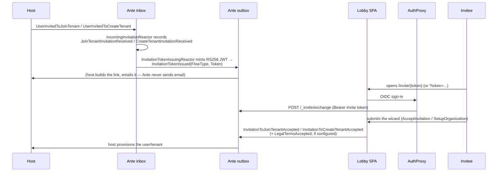

Every invitation Ante ever handles is correlated end to end by one value: the **invitation id**, minted by the host and used as the Chronicle event source id throughout — in the host's own outbox, in Ante's inbox and outbox, and as the `jti` claim of the token Ante issues.

## The flow

## Receiving an invitation

The host appends one of these to its **own** outbox (see [Host Integration](./host-integration.md) for the exact shapes):

- `UserInvitedToJoinTenant(Email, TenantName, Roles)`
- `UserInvitedToCreateTenant(Email, Roles)`
- `InvitationRevoked` (no payload)

`IncomingInvitationReactor`, cross-subscribed to the host's store via the `[EventStore]` attribute, records each as a local event: `JoinTenantInvitationReceived`, `CreateTenantInvitationReceived`, or `InvitationRevocationReceived`. These local events back two read models, `PendingInvitationToJoin` and `PendingInvitationToCreateOrganization`, each removed by `[RemovedWith<...>]` when the matching acceptance or revocation event arrives.

## Issuing the token

`InvitationTokenIssuingReactor` reacts to the freshly-recorded local event and mints an RS256 JWT via `InvitationTokenIssuer`:

- `jti` — the invitation id.
- `invite_type` — `JoinTenant` or `CreateTenant` (`InvitationFlowType`).
- `iss` / `aud` — only set when `Ante:Invitations:Token:Issuer` / `:Audience` are configured; otherwise omitted.
- Expiry — `Ante:Invitations:Token:Expiry`, 7 days by default.

The token is appended to Ante's own outbox as `InvitationTokenIssued(FlowType, Token)`. The host is the one that turns this into a clickable link and emails it — Ante never sends anything itself.

## Opening the link

The lobby reads the token from either `/invite/{token}` or a `token` query-string parameter (`getInvitationToken` in `Invitations/Accepting/invitationToken.ts`). It never verifies the token's signature client-side — it only peeks at the unverified payload to pick which wizard to render before the identity query resolves. The backend is the only place the token is actually trusted, via the exchange endpoint below.

## Exchanging the token for a session

The authentication proxy in front of Ante completes an OIDC sign-in, then calls `POST /_invite/exchange` with the invite token as a `Bearer` credential and a body of shape `ExchangeInviteRequest(Subject, IdentityProvider, ProviderKey?, Issuer?)`. `InviteExchangeProcessor` parses the token locally and checks its shape and expiry — it does not verify the signature; the authentication proxy is the actual trust boundary that must already have validated the caller. A token with no `exp` claim, or one that has already expired, is rejected outright. A valid exchange upserts an `AcceptedInvitation` session document keyed by subject and resolved provider, carrying an expiry copied verbatim from the token's own `exp` claim, so retrying the exchange with the same token — at-least-once delivery, a double-submit, a lost response — converges on the same session instead of creating a duplicate or extending its lifetime. `InvitationIdentityProvider` only honors a session while it remains unexpired, independently of whatever cleanup later removes it from storage. From there, it resolves `InvitationIdentityDetails(InvitationId, FlowType)` for the rest of the request pipeline — first from the `jti`/`invite_type` claims the authentication proxy forwards, falling back to the recorded session.

## Accepting

Three commands complete onboarding, one per journey — see [Wizards](./wizards.md) for the frontend side of each:

| Command | Journey | Resulting event(s) |
|---|---|---|
| `AcceptInvitation(InvitationId, FirstName, MiddleName?, LastName, AcceptedLegalTerms, AcceptedLegalVersion)` | Join an existing tenant | `InvitationToJoinTenantAccepted` (+ `LegalTermsAccepted`) |
| `SetupOrganization(InvitationId, OrganizationName, FirstName, MiddleName?, LastName, AcceptedLegalTerms, AcceptedLegalVersion)` | Create a tenant from an invitation | `InvitationToCreateTenantAccepted` (+ `LegalTermsAccepted`) |
| `RegisterOrganization(RegistrationId, OrganizationName, FirstName, MiddleName?, LastName, AcceptedLegalTerms, AcceptedLegalVersion)` | Self-service, no invitation | `OrganizationRegistrationCompleted` (+ `LegalTermsAccepted`) |

`SetupOrganization` and `RegisterOrganization` both validate the organization name — non-empty, at most 50 characters, and free of characters that would break a downstream MongoDB database name (` / \ . " $ * < > : | ? +`) — and enforce uniqueness twice: an eager read-model check (`AcceptedOrganizationName`) for a friendly validation message, backed by a race-safe `UniqueOrganizationNameConstraint` at append time for the case where two invitations are accepted concurrently with the same name. `RegisterOrganization`'s `RegistrationId` reuses `InvitationId`'s shape (an `EventSourceId<Guid>`) as a client-generated correlation key, since self-service registration follows the same "submit, then poll status" pattern as an invitation acceptance, without an actual prior invitation.

A reactor per journey (`JoinTenantAcceptanceOutbox`, `OrganizationSetupOutbox`, `OrganizationRegistrationOutbox`) forwards the resulting event to Ante's outbox for the host to observe.

## Revocation

`InvitationRevoked` (no payload) arriving in the host's outbox becomes a local `InvitationRevocationReceived`, which removes the invitation from both pending read models via `[RemovedWith<InvitationRevocationReceived>]`. The invitation link stops resolving to anything from that point on.

## Legal consent

A host that wants the wizards to collect terms-and-conditions acceptance registers its own `ILegalDocumentSource`, returning the current `LegalDocumentSet` (terms, privacy policy, a `LegalVersion`). The default, `NoLegalDocumentSource`, always reports nothing to present.

- `LegalTermsRules.Apply` — shared across all three command validators — requires `AcceptedLegalTerms == true` and that `AcceptedLegalVersion` matches the version currently presented, but **only** when a document source has something to present. When it does not, the rule imposes nothing.
- Every wizard skips the terms step entirely when no document source is configured — there is no field to fill in and nothing to reject.
- Opening a document from the acceptance checkbox's inline links (`useLegalDocumentViewer` / `LegalDocumentDialog`) never accepts it — the click that opens the dialog calls `preventDefault` specifically so it cannot also toggle the checkbox.
- `LegalTermsAccepted(TenantName, IdentityProvider, IdentityProviderSubject, Version)` is appended alongside the acceptance event only when the user actually accepted, and forwarded to the host's inbox by `LegalTermsAcceptanceOutbox` — one reactor shared by all three onboarding flows.

## Next steps

- [Host Integration](./host-integration.md) — the exact event shapes and what a host must emit and consume.
- [Wizards](./wizards.md) — how the lobby SPA drives this flow.
