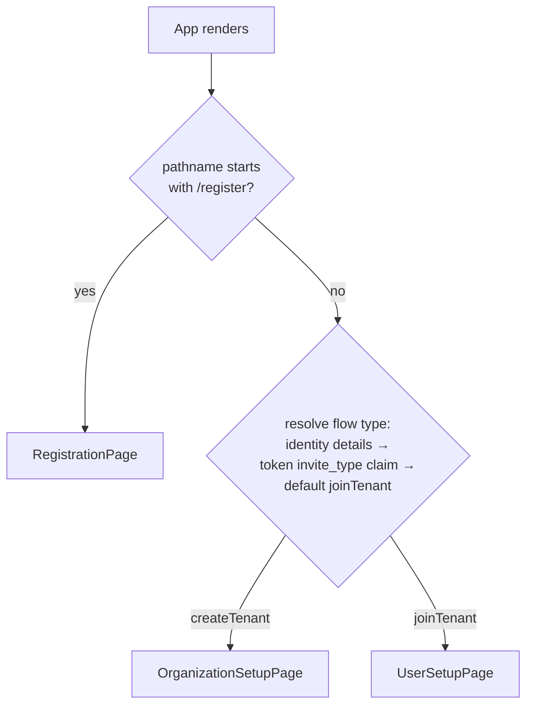

The lobby SPA is one React application (`Source/Ante/.frontend/App.tsx`) that renders exactly one of three wizards, each built on `@cratis/components`' `CommandStepper` / `StepperPanel`.

## Routing



`App` checks `window.location.pathname` directly: `/register` or `/register/*` renders `RegistrationPage`; anything else renders `InvitationRouter`. `InvitationRouter` resolves the flow type in priority order — the `useIdentity(InvitationIdentityDetails)` query's `flowType`, then the unverified `invite_type` claim decoded from the invitation token in the URL, then a default of `joinTenant` — and picks `OrganizationSetupPage` for `createTenant`, `UserSetupPage` otherwise. The invitation token itself is read from either the `/invite/{token}` path or a `?token=` query parameter (see [Invitation Lifecycle](./invitation-lifecycle.md#opening-the-link)).

## The three journeys

| Wizard | Component | Command | Steps |
|---|---|---|---|
| Join an existing tenant | `UserSetupPage` | `AcceptInvitation` | User information → terms (conditional) |
| Create a tenant from an invitation | `OrganizationSetupPage` | `SetupOrganization` | Organization name → user information → terms (conditional) |
| Self-service registration | `RegistrationPage` (at `/register`) | `RegisterOrganization` | Organization name → user information → terms (conditional) |

The terms step only exists when `Legal/LegalDocuments.Current` reports `isConfigured: true` — see [Invitation Lifecycle](./invitation-lifecycle.md#legal-consent). All three wizards use `validateOnInit` so the eager server-side validation (organization name uniqueness, required names) surfaces before the invitee reaches the final step.

## The StepperPanel structural constraint

`CommandStepper` and `CommandForm` discover which fields belong to the command by walking their JSX children **as authored** — they cannot see a field rendered from inside another component's own render body. Every direct child of `CommandStepper` must literally be a `StepperPanel`, not a component that merely renders one:

```tsx
{/* Correct — StepperPanel is a direct JSX child */}
<CommandStepper command={AcceptInvitation} /* ... */>
    {userInformationPanel}
    {legalStatus.data?.isConfigured && (
        <StepperPanel header={strings.userSetup.stepTermsConditions}>
            <LegalAcceptanceField value={c => c.acceptedLegalTerms} onShowDocument={legalDocuments.showDocument} />
        </StepperPanel>
    )}
</CommandStepper>
```

Wrapping a step's contents in an extra component that itself renders a `StepperPanel` breaks this: the stepper still counts it as a step but never displays the panel, which pushes whichever step comes after it into the position the stepper treats as final — so pressing "Next" submits the command with, for example, the terms still unaccepted, instead of showing the terms step at all. `userInformationPanel` above is a plain JSX expression assigned to a variable, not a component call, which is why it is safe to inline this way.

## Status polling and redirect

Once a wizard's command succeeds, the page switches to a waiting state and polls an observable status query rather than trusting the command's own success as the end state — provisioning on the host side is asynchronous relative to Ante's own append:

- `UserSetupPage` polls `UserSetupAcceptanceStatusView.StatusForInvitation` and reacts to three states: `pending` (keep waiting), `accepted` (redirect), and `timedOut` (show an error — this wizard is the only one with a timeout state).
- `OrganizationSetupPage` and `RegistrationPage` poll `OrganizationSetupAcceptanceStatusView.StatusForInvitation`, which only has `pending` and `accepted` — neither wizard has a timeout branch.

`accepted` reflects **Published**, not merely **Recorded** — see [Invitation Lifecycle](./invitation-lifecycle.md#publication-and-durable-status). Both status queries read durable evidence from Ante's own event log and its outbox on every call, so the value a client observes is correct regardless of which replica handles the request and survives an Ante restart in between; a submitted command that has only been recorded locally, or whose required legal fact has not yet reached the outbox, keeps reporting `pending`. Nothing about this polling loop assumes the same process (or even the same replica) handled the original command.

On `accepted`, all three build a redirect URL from the `HostAppUrl` query (`Configuration.HostUrl`), substituting the `{tenant}` placeholder with the organization name for the two organization-creating wizards (`resolveHostAppRedirectUrl`), and appending the resolved `SignInPath` when one is known — deep-linking the same identity provider the invitee just authenticated with, so entering the host application is a silent round trip rather than a second provider-selection screen. `UserSetupPage` inlines the equivalent logic since it has no organization name to substitute.

`UserSetupPage`'s `timedOut` state is declared in `UserSetupAcceptanceStatus` but nothing on the backend currently transitions to it — no timeout detection exists yet for a join-tenant acceptance that never reaches Published. Treat it as reserved for future use, not as documentation of a shipped behavior.

## Next steps

- [Invitation Lifecycle](./invitation-lifecycle.md) — the events and commands behind each wizard.
- [Host Integration](./host-integration.md) — what the host and its authentication proxy must provide for a wizard to have an identity to onboard.
