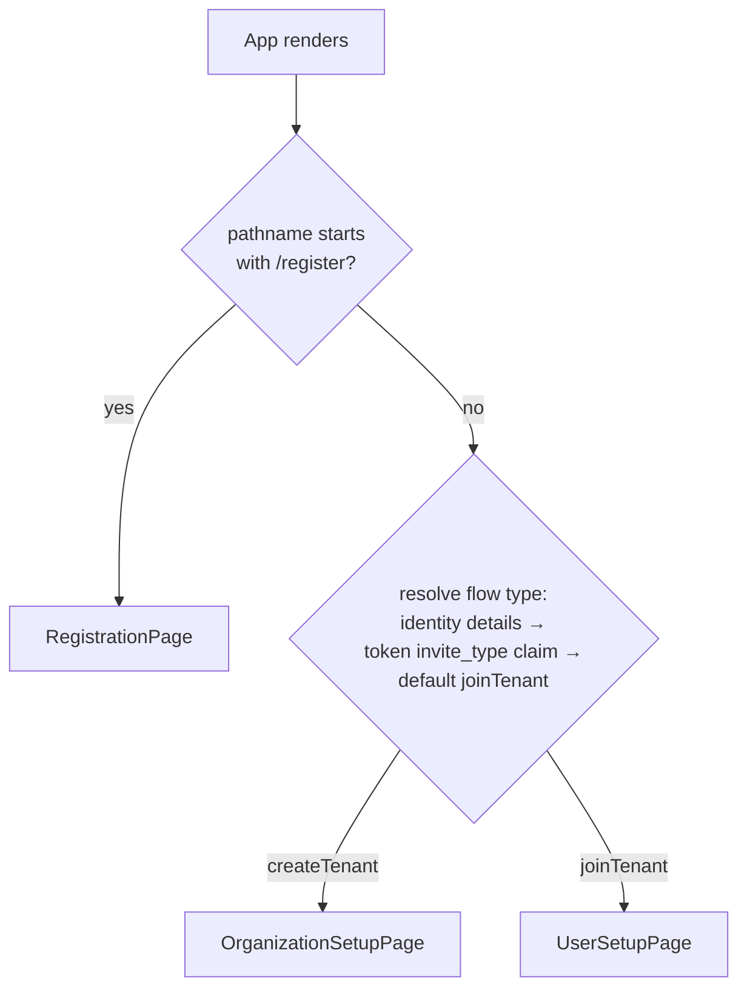

The lobby SPA is one React application (`Source/Ante/.frontend/App.tsx`) that renders exactly one of three wizards, each built on `@cratis/components`' `CommandStepper` / `StepperPanel`.

## Routing



`App` checks `window.location.pathname` directly: `/register` or `/register/*` renders `RegistrationPage`; anything else renders `InvitationRouter`. `InvitationRouter` resolves the flow type in priority order — the `useIdentity(InvitationIdentityDetails)` query's `flowType`, then the unverified `invite_type` claim decoded from the invitation token in the URL, then a default of `joinTenant` — and picks `OrganizationSetupPage` for `createTenant`, `UserSetupPage` otherwise. The invitation token itself is read from either the `/invite/{token}` path or a `?token=` query parameter (see [Invitation Lifecycle](./invitation-lifecycle.md#opening-the-link)).

## The three journeys

| Wizard | Component | Command | Steps |
|---|---|---|---|
| Join an existing tenant | `UserSetupPage` | `AcceptInvitation` | User information → terms (conditional) |
| Create a tenant from an invitation | `OrganizationSetupPage` | `SetupOrganization` | Organization name → user information → terms (conditional) |
| Self-service registration | `RegistrationPage` (at `/register`) | `RegisterOrganization` | Organization name → user information → terms (conditional) |

The terms step only exists when `Legal/LegalDocuments.Current` reports `isConfigured: true` — see [Invitation Lifecycle](./invitation-lifecycle.md#legal-consent). All three wizards use `validateOnInit` so the eager server-side validation (organization name uniqueness, required names) surfaces before the invitee reaches the final step.

## The StepperPanel structural constraint

`CommandStepper` and `CommandForm` discover which fields belong to the command by walking their JSX children **as authored** — they cannot see a field rendered from inside another component's own render body. Every direct child of `CommandStepper` must literally be a `StepperPanel`, not a component that merely renders one:

```tsx
{/* Correct — StepperPanel is a direct JSX child */}
<CommandStepper command={AcceptInvitation} /* ... */>
    {userInformationPanel}
    {legalStatus.data?.isConfigured && (
        <StepperPanel header={strings.userSetup.stepTermsConditions}>
            <LegalAcceptanceField value={c => c.acceptedLegalTerms} onShowDocument={legalDocuments.showDocument} />
        </StepperPanel>
    )}
</CommandStepper>
```

Wrapping a step's contents in an extra component that itself renders a `StepperPanel` breaks this: the stepper still counts it as a step but never displays the panel, which pushes whichever step comes after it into the position the stepper treats as final — so pressing "Next" submits the command with, for example, the terms still unaccepted, instead of showing the terms step at all. `userInformationPanel` above is a plain JSX expression assigned to a variable, not a component call, which is why it is safe to inline this way.

## Status polling, recovery, and redirect

Once a wizard's command succeeds, the page switches to a waiting phase and polls an observable status query rather than trusting the command's own success as the end state — provisioning on the host side is asynchronous relative to Ante's own append. Both status views report the same three durable states, `pending` / `recorded` / `accepted`:

- `UserSetupPage` polls `UserSetupAcceptanceStatusView.StatusForInvitation`.
- `OrganizationSetupPage` and `RegistrationPage` poll `OrganizationSetupAcceptanceStatusView.StatusForInvitation`.

`pending` means nothing has been recorded yet — the only state in which (re)submitting the form is safe. `recorded` reflects **Recorded** (see [Invitation Lifecycle](./invitation-lifecycle.md#publication-and-durable-status)): the command has already appended, so the wizard must keep waiting rather than show the form again — resubmitting would collide with the one-use invitation constraint, or, for self-service registration, re-claim the same organization name. `accepted` reflects **Published**, never merely Recorded. All three status reads pull durable evidence from Ante's own event log and its outbox on every call, so the value a client observes is correct regardless of which replica handles the request and survives an Ante restart in between, and a client's own subject is only ever moved forward (`pending → recorded → accepted`), never backward, so a slow reconnect's read cannot regress a state another tab watching the same operation has already observed. Nothing about this polling loop assumes the same process (or even the same replica) handled the original command.

Each page derives its render phase from this durable status rather than from a process-local flag — a shared `OnboardingRecoveryState` (`Invitations/OnboardingRecoveryState.ts`, bound to React via `useOnboardingRecovery`) resolves `form` / `waiting` / `timedOut`:

- `form` — status is `pending` and nothing was submitted this session: safe to render the wizard.
- `waiting` — the wizard's own command just succeeded, **or** durable status already reports `recorded`/`accepted`: never show the form again once something has been submitted, even after a reload, a second tab, or returning later.
- `timedOut` — waiting has continued for longer than a local timeout window (20 seconds by default) without reaching `accepted`. This never claims failure: the underlying status observation keeps running, so a late `accepted` clears the timed-out state automatically and still redirects (`OnboardingRecoveryState.updateStatus` always wins over a local timeout) — "Check again" only resets the local timeout window, it does not create a new operation. All three wizards support this identically; `OrganizationSetupPage` and `RegistrationPage` share the composition through `useOrganizationSetupHandoff`.

On `accepted`, all three build a redirect URL from the `HostAppUrl` query (`Configuration.HostUrl`), substituting the `{tenant}` placeholder with the organization name for the two organization-creating wizards (`resolveHostAppRedirectUrl`), and appending the resolved `SignInPath` when one is known — deep-linking the same identity provider the invitee just authenticated with, so entering the host application is a silent round trip rather than a second provider-selection screen. `UserSetupPage` inlines the equivalent logic since it has no organization name to substitute. Resolving the redirect URL is wrapped so a malformed host configuration surfaces as the existing "could not determine where to take you next" message instead of an uncaught exception — setup already published by that point, so nothing about the person's submission is lost.

**Optional host outcome completion screen.** `UserSetupPage` and `OrganizationSetupPage` (not `RegistrationPage` — see below) redirect exactly as above when `Ante:HostOutcomeUrl` is unset. When it is set, `resolveHostOutcomeGate` (`Invitations/HostOutcomeGate.ts`) switches them from the automatic redirect to a completion screen once `accepted`: it shows the host-reported outcome for that attempt (`useHostOutcome`, backed by `HostOutcomeView.ForAttempt`) — pending, succeeded, or failed, with a reason code on failure — alongside a "Continue" action that performs the exact same redirect on demand. The lookup is authenticated and attempt-bound (`ISignedInIdentity.IsVerifiedOwnerOf`), so it is never shown for someone else's attempt, and it never blocks: "Continue" is available immediately regardless of what the host has reported, and a host-reported failure never rewrites Ante's own published onboarding as failed. `RegistrationPage` never opts into this — self-service registration's client-generated registration id has no verified-owner session for `IsVerifiedOwnerOf` to check, so it keeps the unconditional automatic redirect regardless of `Ante:HostOutcomeUrl`. See [Host Integration: the host outcome backchannel](./host-integration.md#the-host-outcome-backchannel).

`RegistrationPage` has no invitation to derive an id from, so it persists a versioned, opaque registration-id pointer per browser tab (`RegistrationOperation.ts`, `sessionStorage`) rather than minting a new id on every mount — a reload or a return later resumes polling the same durable registration instead of losing track of what was already submitted. The pointer is never more than an id: no profile draft, identity claim, legal content, or token is ever persisted client-side. Two tabs opened to `/register` each get their own pointer (`sessionStorage` is per-tab); a person who deliberately wants to register a different organization can clear it explicitly (the "Register a different organization" action on the timed-out/error states).

## Render failure recovery

None of the phases above are what a render error looks like. A bug in a component, or a branding/provider initialization failure, is caught by a boundary wrapping the whole application and replaced with a minimal, safe-language recovery screen and a reload action — see [Boundaries: Render failure recovery](./boundaries.md#render-failure-recovery). The `form`/`waiting`/`timedOut` phases above remain how the wizards represent network and command outcomes; the recovery boundary never intercepts those, only an actual render error.

## Next steps

- [Invitation Lifecycle](./invitation-lifecycle.md) — the events and commands behind each wizard.
- [Host Integration](./host-integration.md) — what the host and its authentication proxy must provide for a wizard to have an identity to onboard.
